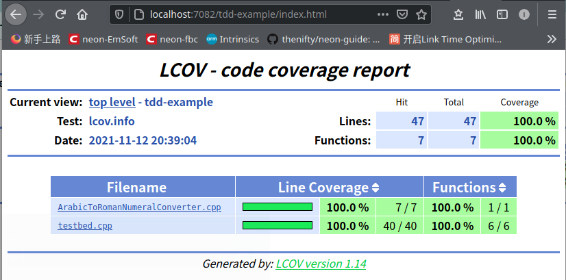
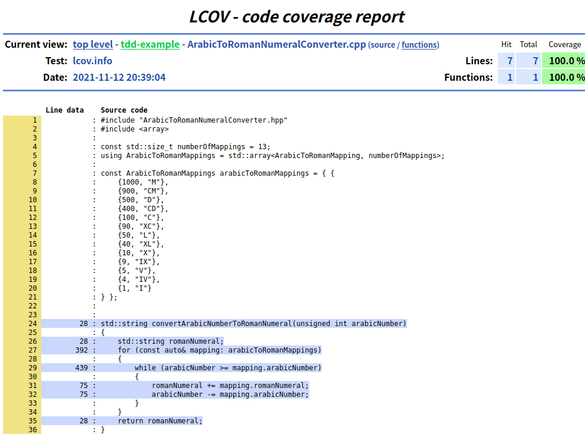

# tdd-example

## Intro
Implement Arabic to Roman numerals converter, in a TDD(Test-Driven-Development) manner.

Using googletest as testing framework.

Support both GCC and Clang for testing coverage reporting.

## Get source
```bash
cd ~/work
git clone https://github.com/zchrissirhcz/tdd-example
cd tdd-example
code-insiders .
```

## Usage
```bash
mkdir build && cd build
cmake ..
make # compile and linking

make test # run unit tests.
make coverage # report test coverage. will call `make test` before reporting automatically.

cd coverage_report
python -m http.server 7082
```

## Screenshots


